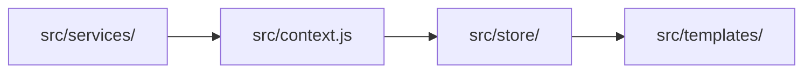

# Example App

Next.js app that user the pages router.

## Structure

All root-level files and folders are part of the initial Next.js setup and common Next.js conventions, with the exception of `src`. All custom code is located within `src` folder.

The `src` folder is further divided into the following folders and files. These can be grouped into one of two categories: **rendering pipeline** and **global helpers**.

### Rendering

Files and folders associated with the rendering pipeline are responsible for managing the data and how that data is represented in the app. Data often flows in one direction, either originating from an external service or directly within the global app store as follows.

- `src/services/` - Contains all code that interfaces with data that is not included within the app logic itself. This can include, REST, GraphQL, web storage and/or third-party SaaS tooling. Each service is located in its own sub-folder.

- `src/context.js` - Primarily used expose external data behaviour to the app logic by means of [dependency injection](https://en.wikipedia.org/wiki/Dependency_injection). Makes it easier to extend, replace and mock external services.

- `src/store/` - A single global store created with Zustand. This is where all app logic is managed. Note that the store itself is never directly exposed to the app logic. Instead it is interacted with by means of slice-specific hooks or methods that wrap behaviour. Each slice corresponds to a root-level key in the store and is located in its own sub-folder.

- `src/views/` - Views contain mutually exclusive, full page route-specific components. These views are often called directly from Next.js `pages` files in the project root. Each view generally has a stateless top-level component that is primarily concerned with layout and composition (and is located in a sub-folder called `View`). In addition, there are also other sub-folders corresponding to components called within the `View`. It is assumed that each of these components are stateless, for testing and composition purposes. However, these components can have a adjacent `*.Container` component that uses render props to pass state to a component.

### Global Helpers

Global helpers are not responsible for managing a specific piece of data, but rather provide logic that is used throughout the app.

These includes:

- `src/components/`
- `src/constants.js`
- `src/models/`
